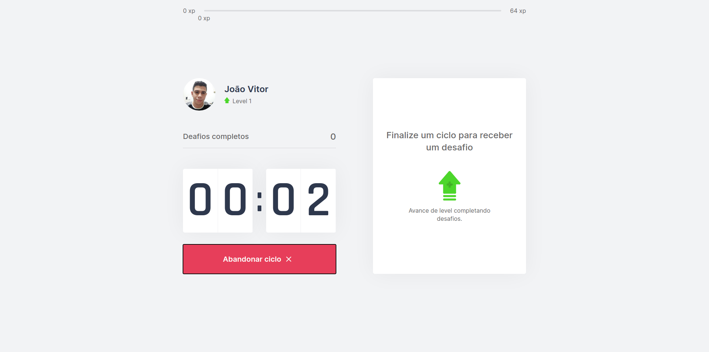
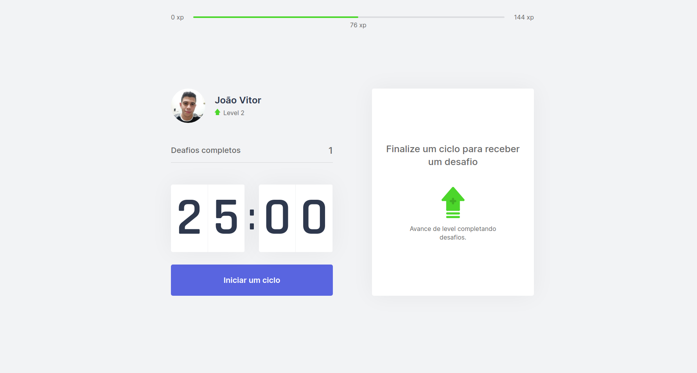
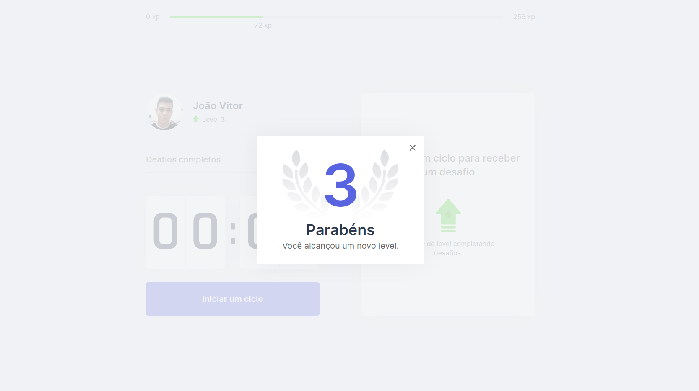

<h1 align="center">
  
</h1>
<p align="center">
  <a>
    
  </a>
  <a>
    
  </a>
  <a>
    
  </a>
  <a href="https://lbesson.mit-license.org/" target="_blank">
    
  </a>
</p>

<h4 align="center"> 
 Moveit 1.0 | Concluído 🚀 
</h4>

<p align="center">
   <a href="#-sobre-o-projeto">Sobre</a> •
   <a href="#-layout">Layout</a> • 
   <a href="#-como-executar-este-projeto">Como executar</a> • 
   <a href="#-tecnologias">Tecnologias</a> •
  <a href="#-autor">Autor</a> •
  <a href="#-licenca">Licença</a> 
</p>

## 💻 Sobre o projeto
O **Moveit** é uma aplicação que aplica o método de Pomodoro🍎. Esse método consiste em a pessoa realizar uma determinada tarefa em 25 minutos, sendo ela concluída ou não, a pessoa deve parar e descansar 5 minutos.
Porém nessa aplicação após 25 minutos é disponibilizado um desafio, um pequeno exercício para aliviar a tensão e relaxar o corpo. A cada desafio completado a pessoa ganha pontos (xp) para subir de nível.
<br>
##### Projeto desenvolvido durante a **NLW#04 - Next Level Week** oferecida pela [Rocketseat](https://rocketseat.com.br/).

---

## 🎨 Layout
<a href="https://www.figma.com/file/ge20pu3ofMOKoliUyKx1Nl/Move.it-1.0?node-id=160%3A2761">
  
</a>

### Web

<p align="center">
  
</p>
 <br>
 <p align="center">
    
    
 </p>
 
---

## 🚀 Como executar este projeto 

### Pré-requisitos
Para executar esta aplicação, você deverá ter instalado em sua máquina as seguintes ferramentas:
* [Git](https://git-scm.com/)
* [Node.js](https://nodejs.org/en/)
* [NPM](https://www.npmjs.com/get-npm) ou [Yarn](https://yarnpkg.com/)

### 🎲 Rodando a aplicação web
```bash
# Clone este repositório -> usando SSH
$ git clone git@github.com:joaovitorJS/nlw-04-moveit.git

# Acesse a pasta do projeto no seu terminal
$ cd nlw-04-moveit

## Passos com yarn
# Instale as dependências
$ yarn add

# Execute a aplicação em modo de desenvolvimento
$ yarn dev

## Passos com npm
# Instale as dependências
$ npm install

# Execute a aplicação em modo de desenvolvimento
$ npm run dev

# O servidor inciará na porta:3000 - acesse http://localhost:3000 em seu navegador
```
---

### ⚙️ Tecnologias

* **[TypeScript](https://www.typescriptlang.org/)**
* **[ReactJS](https://pt-br.reactjs.org/)**
* **[NextJS](https://nextjs.org/)**
* **[JS-Cookie](https://www.npmjs.com/package/js-cookie)**

> Veja o arquivo  [package.json](https://github.com/joaovitorJS/nlw-04-moveit/blob/master/package.json)

---

### 👨🏻‍💻 Autor
<br>

**[João Vitor](https://github.com/joaovitorJS)**

#### Entre em contato

<p>
<a href="https://www.linkedin.com/in/jo%C3%A3o-vitor-oliveira-85a886174/" target="_blank">
 
</a>
&nbsp;
<a href="mailto:rgm38342@comp.uems.br">
 
</a>
</p>

---

### 📝 Licença
Este projeto esta sobe a licença [MIT](https://opensource.org/licenses/MIT).
